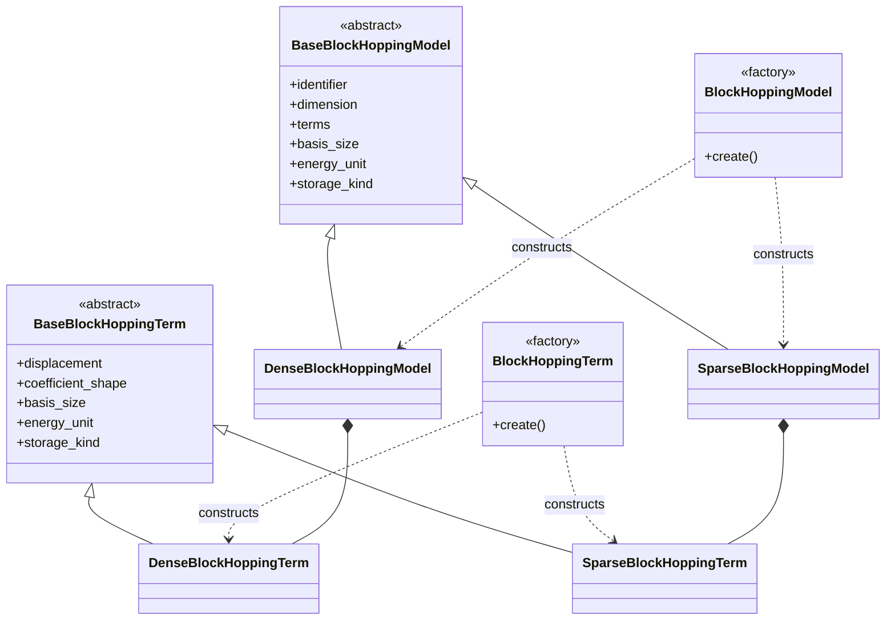

# Block-hopping schematics

## Ownership hierarchy

```mermaid
classDiagram
    class BaseBlockHoppingTerm {
        <<abstract>>
        +displacement
        +coefficient_shape
        +basis_size
        +energy_unit
        +storage_kind
    }
    class DenseBlockHoppingTerm
    class SparseBlockHoppingTerm
    class BlockHoppingTerm {
        <<factory>>
        +create()
    }
    class BaseBlockHoppingModel {
        <<abstract>>
        +identifier
        +dimension
        +terms
        +basis_size
        +energy_unit
        +storage_kind
    }
    class DenseBlockHoppingModel
    class SparseBlockHoppingModel
    class BlockHoppingModel {
        <<factory>>
        +create()
    }

    BaseBlockHoppingTerm <|-- DenseBlockHoppingTerm
    BaseBlockHoppingTerm <|-- SparseBlockHoppingTerm
    BlockHoppingTerm ..> DenseBlockHoppingTerm : constructs
    BlockHoppingTerm ..> SparseBlockHoppingTerm : constructs
    BaseBlockHoppingModel <|-- DenseBlockHoppingModel
    BaseBlockHoppingModel <|-- SparseBlockHoppingModel
    BlockHoppingModel ..> DenseBlockHoppingModel : constructs
    BlockHoppingModel ..> SparseBlockHoppingModel : constructs
    DenseBlockHoppingModel *-- DenseBlockHoppingTerm
    SparseBlockHoppingModel *-- SparseBlockHoppingTerm
```

## Navigation

- [Module index](index.md)
- [Numerical contract](numerics.md)
- [Scientific contract](scientifics.md)
