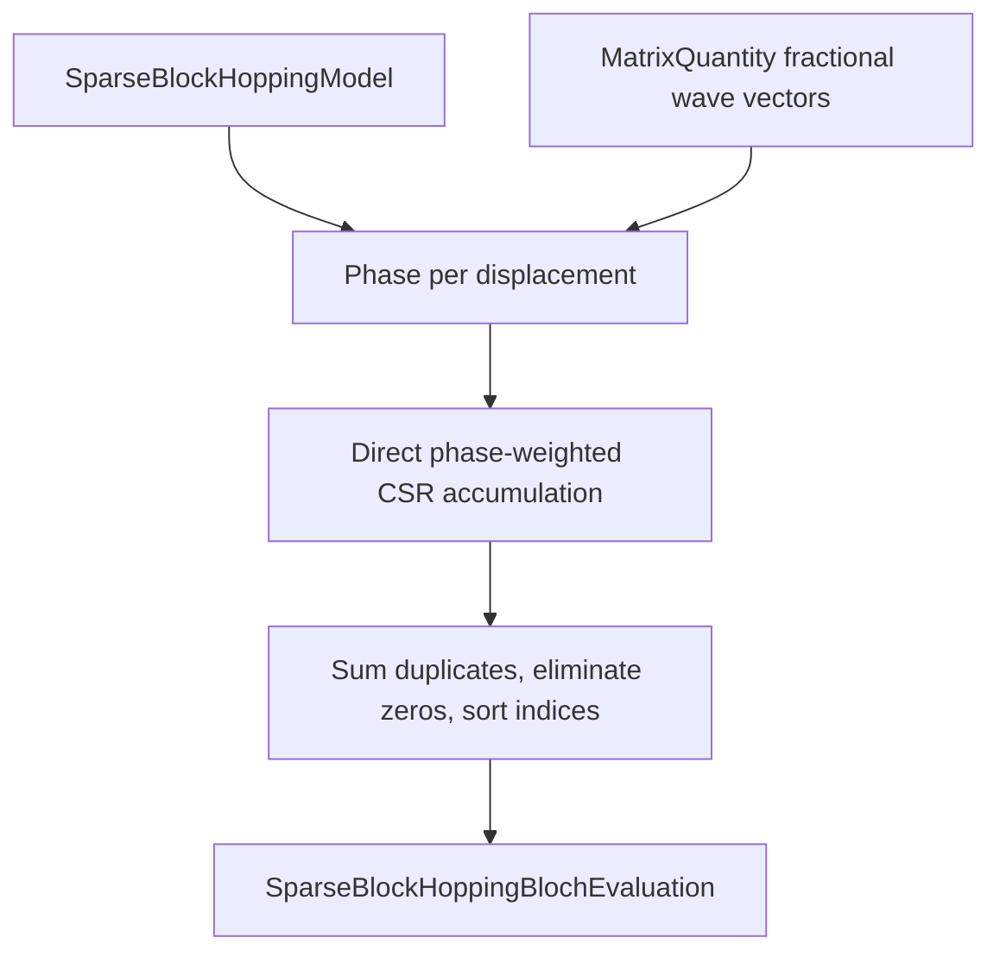

# `SparseBlockHoppingBlochEvaluator` schematics

```mermaid
flowchart TD
    M[SparseBlockHoppingModel]
    Q[MatrixQuantity fractional wave vectors]
    PHASE[Phase per displacement]
    CSR[Direct phase-weighted CSR accumulation]
    CANON[Sum duplicates, eliminate zeros, sort indices]
    RESULT[SparseBlockHoppingBlochEvaluation]

    M --> PHASE
    Q --> PHASE
    PHASE --> CSR --> CANON --> RESULT
```

- [Index](index.md)
- [Numerics](numerics.md)
- [Scientific contract](scientifics.md)
