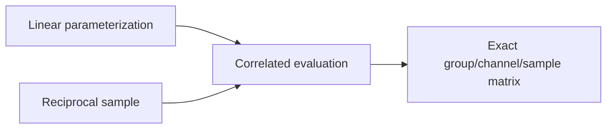

# `HomopolarSp3sStarLinearBlochEvaluation` schematics

```mermaid
flowchart LR
    P[Linear parameterization] --> R[Correlated evaluation]
    Q[Reciprocal sample] --> R
    R --> M[Exact group/channel/sample matrix]
```

- [Index](index.md)
