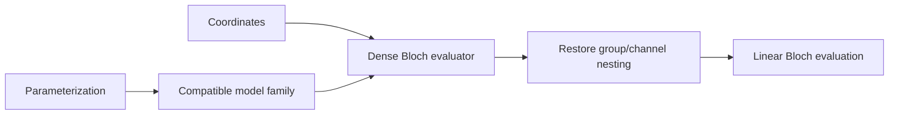

# `HomopolarSp3sStarLinearBlochEvaluator` schematics

```mermaid
flowchart LR
    P[Parameterization] --> F[Compatible model family]
    Q[Coordinates] --> E[Dense Bloch evaluator]
    F --> E --> G[Restore group/channel nesting]
    G --> R[Linear Bloch evaluation]
```

- [Index](index.md)
