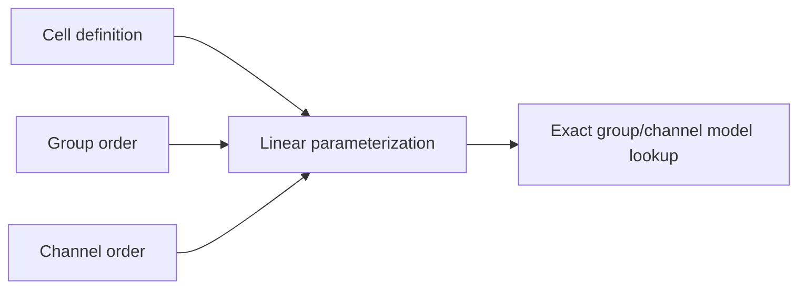

# `HomopolarSp3sStarLinearParameterization` schematics

```mermaid
flowchart LR
    D[Cell definition] --> R[Linear parameterization]
    G[Group order] --> R
    C[Channel order] --> R
    R --> M[Exact group/channel model lookup]
```

- [Index](index.md)
