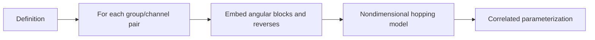

# `HomopolarSp3sStarLinearParameterizationAssembler` schematics

```mermaid
flowchart LR
    D[Definition] --> P[For each group/channel pair]
    P --> E[Embed angular blocks and reverses]
    E --> M[Nondimensional hopping model]
    M --> R[Correlated parameterization]
```

- [Index](index.md)
